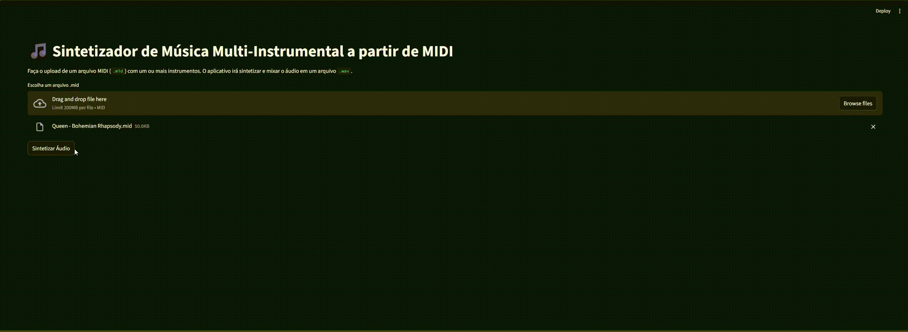

# Sintetizador Musical Multi-Instrumental com Python

[](https://www.python.org/)
[](https://www.gnu.org/licenses/gpl-3.0)
[](https://streamlit.io)

Um sintetizador de áudio baseado na web que lê arquivos MIDI multi-instrumentais e os converte em áudio `.wav`, usando um motor de síntese aditiva em Python.

---

### Demonstração



## 🎹 Sobre o Projeto

Este projeto nasceu como um Trabalho de Conclusão de Curso e evoluiu para uma aplicação web completa e interativa. Para uma análise aprofundada da teoria por trás da implementação, **[consulte a monografia completa aqui](Monografia_Axl.pdf)**.

A aplicação permite que o usuário faça o upload de um arquivo MIDI com múltiplas trilhas (instrumentos) e o sintetizador processa cada trilha individualmente, atribuindo timbres customizáveis e respeitando o tempo absoluto de cada nota. O resultado é um arquivo de áudio mixado e normalizado que pode ser reproduzido diretamente no navegador e baixado pelo usuário.

O resultado é um arquivo de áudio mixado e normalizado que pode ser reproduzido diretamente no navegador e baixado pelo usuário. Todo o ambiente de desenvolvimento é containerizado com **Docker** e **VS Code Dev Containers**, garantindo total reprodutibilidade.

## ⚠️ Status Atual do Projeto

Este projeto está em desenvolvimento ativo e ainda não atingiu sua versão final 1.0. Agradeço o interesse e o feedback!

* **Protótipo Funcional:** A aplicação está totalmente funcional para quem seguir os passos de execução no ambiente de desenvolvimento (com Docker e VS Code).

* **Sem Executável ou Link Público:** No momento, **não há um executável de um clique (`.exe`) ou um link público para usar a aplicação diretamente pelo navegador**. O foco até agora foi na construção do motor de síntese, na estrutura do código e na interface local.

* **Próximos Passos:** Estou pesquisando e trabalhando ativamente para fazer o *deploy* da aplicação na nuvem (utilizando o Streamlit Community Cloud ou uma plataforma similar). O objetivo é que, em breve, qualquer pessoa possa acessar e usar o sintetizador através de um simples link, sem precisar de nenhuma instalação.


## 🛠️ Tecnologias Utilizadas

* **Linguagem:** Python
* **Interface Web:** Streamlit
* **Processamento de Áudio e Numérico:** NumPy, SciPy
* **Leitura de MIDI:** Pretty MIDI
* **Ambiente:** Docker & VS Code Dev Containers

## 📂 Estrutura de Arquivos

```
MusicaPython/
├── .devcontainer/
│   └── devcontainer.json   # Configuração do ambiente de desenvolvimento
├── data/                   # Onde os arquivos .wav gerados são salvos
├── temp/                   # Para salvar temporariamente os MIDIs de upload
├── Dockerfile              # "Receita" para construir a imagem Docker
├── LICENSE
├── README.md
├── app.py                  # O código da interface web com Streamlit
├── funcoes.py              # Funções de baixo nível para síntese de som (ondas, ADSR)
├── midi_parser.py          # Módulo para ler e interpretar arquivos MIDI
├── requirements.txt        # Lista de dependências Python
├── sound_generator.py      # Orquestra a síntese e a mixagem das trilhas
└── timbres.py              # Define os presets de som para os instrumentos
```

## 🚀 Como Executar (Ambiente de Desenvolvimento)

Graças ao Docker, configurar o ambiente é extremamente simples.

**Pré-requisitos:**
* [Docker Desktop](https://www.docker.com/products/docker-desktop/)
* [Visual Studio Code](https://code.visualstudio.com/)
* Extensão [Dev Containers](https://marketplace.visualstudio.com/items?itemName=ms-vscode-remote.remote-containers) da Microsoft instalada no VS Code.

**Passos:**

1.  **Clone o repositório:**
    ```bash
    git clone [https://github.com/axlandrade/MusicaPython](https://github.com/axlandrade/MusicaPython
    ```

2.  **Abra no VS Code:**
    Abra a pasta do projeto no VS Code. Uma notificação aparecerá no canto inferior direito.

3.  **Reabra no Container:**
    Clique em **"Reopen in Container"**. O VS Code irá construir a imagem Docker e configurar todo o ambiente para você. (Isso pode demorar alguns minutos na primeira vez).

4.  **Execute a Aplicação:**
    Quando o ambiente estiver pronto, abra um terminal no VS Code (`Ctrl+'`) e execute:
    ```bash
    streamlit run app.py
    ```

5.  **Acesse a Interface:**
    O terminal mostrará uma URL local. O VS Code também oferecerá para abrir a porta no seu navegador. Acesse a URL (`http://localhost:8501`) e comece a usar!

## 💡 Próximos Passos e Possíveis Melhorias

O projeto tem um grande potencial para expansão. Algumas ideias:

- [ ] **UI de Controle de Timbres:** Adicionar sliders na interface para que o usuário possa criar e modificar os sons dos instrumentos em tempo real.
- [ ] **Novas Formas de Onda:** Implementar ondas quadradas, triangulares e dente de serra para criar sons de sintetizadores clássicos.
- [ ] **Adicionar Efeitos:** Implementar efeitos de Reverb, Delay ou Chorus.
- [ ] **Visualização:** Mostrar um "piano roll" básico do MIDI que foi carregado.
- [ ] **Otimização:** Para MIDIs muito grandes, a síntese pode ser lenta. Explorar otimizações com `multiprocessing` ou `numba`.

## Licença

Este projeto está licenciado sob a Licença Pública Geral GNU v3.0 - veja o arquivo [LICENSE](LICENSE) para mais detalhes.

## Autor

- **Axl** - *Desenvolvimento do Código*